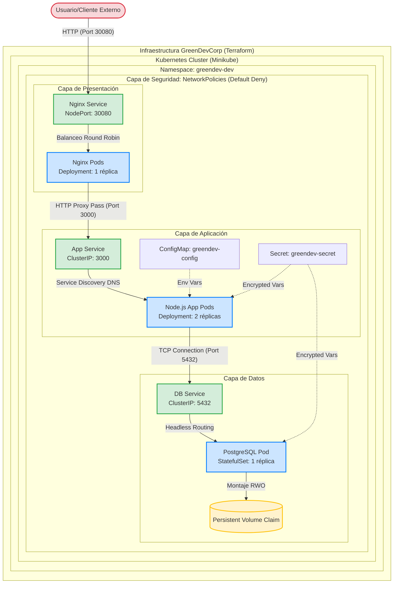

# Arquitectura Final de GreenDevCorp

## 1. Diagrama de Arquitectura Global (Contenedores, Redes y Flujos)

El siguiente diagrama detalla la arquitectura técnica implementada en Kubernetes y gestionada mediante **Terraform (IaC)**. Incluye la segmentación de red por puertos y la capa de seguridad impuesta por las **NetworkPolicies**.

## 2. Detalle de Flujos de Datos y Red

El recorrido de una petición desde el exterior hasta la persistencia de datos está estrictamente controlado por políticas de red:

1. **Recepción Externa (Port 30080):** El tráfico llega al puerto físico de Minikube. El `Nginx Service` de tipo NodePort redirige la petición hacia el pod de Nginx.
2. **Capa de Seguridad 1 (Ingress Policy):** La NetworkPolicy del frontend solo permite tráfico entrante desde la red permitida hacia el puerto 80/443 del contenedor.
3. **Capa Proxy a App (Port 3000):** Nginx actúa como proxy inverso. El tráfico viaja internamente mediante el `App Service` (ClusterIP). La NetworkPolicy del backend **deniega** cualquier conexión que no provenga específicamente de un pod etiquetado como `app=frontend`.
4. **Capa App a DB (Port 5432):** La aplicación Node.js procesa la lógica y consulta la base de datos. La conexión utiliza el nombre DNS interno `db-service`. 
5. **Capa de Seguridad 2 (DB Protection):** La NetworkPolicy de la base de datos es la más restrictiva: **solo acepta tráfico entrante desde el Backend**. Intentar conectar desde el frontend o desde un pod de "debugging" resultará en un rechazo inmediato por red.
6. **Persistencia:** El pod de PostgreSQL (gestionado como un **StatefulSet** para garantizar identidad estable) escribe en el volumen montado a través del PVC.

## 3. Documentación de Microservicios

Todo el ecosistema está orquestado exclusivamente mediante **Terraform**, que aplica los manifiestos correspondientes utilizando el provider de Kubernetes.

### 3.1 Nginx (Proxy Inverso)
* **Función:** Balanceador de carga y terminador de tráfico externo.
* **Recurso K8s:** Deployment (1 réplica) + Service (NodePort).
* **Seguridad:** Aislado mediante `frontend-policy`.

### 3.2 Node.js Application (Backend)
* **Función:** Ejecución de la lógica de negocio y procesamiento de API.
* **Recurso K8s:** Deployment (2 réplicas) + Service (ClusterIP).
* **Configuración:** Consume variables del ConfigMap `greendev-config` y secretos de `greendev-secret`.

### 3.3 PostgreSQL (Capa de Datos)
* **Función:** Almacenamiento persistente relacional.
* **Recurso K8s:** **StatefulSet** (1 réplica) + Service (ClusterIP/Headless).
* **Persistencia:** Utiliza un `PersistentVolumeClaim` vinculado a un volumen local en Minikube para asegurar que los datos sobreviven a reinicios.
