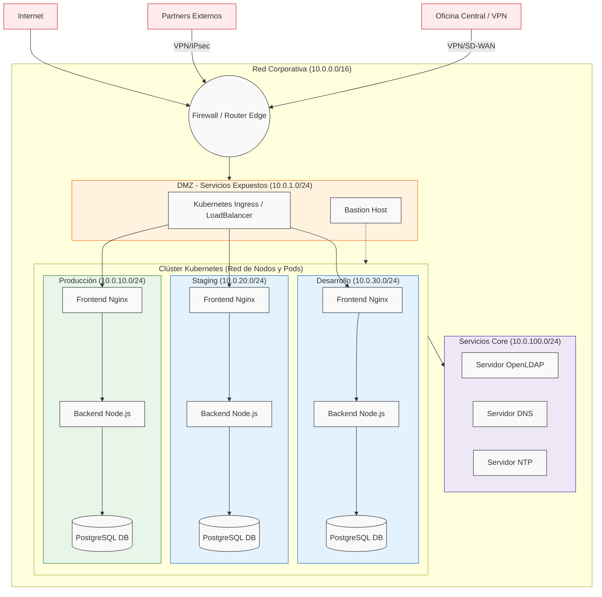

# Semana 12: Diseño de Red e Identidad

Este documento unifica el diseño de red (segmentación CIDR y NetworkPolicies), la investigación sobre servicios core e identidad, y la metodología de pruebas para verificar el correcto aislamiento de los recursos en Kubernetes.

---

## PARTE 1: Diseño de Arquitectura de Red y Planificación CIDR

### 1.1 Diagrama de Arquitectura de Red



### 1.2 Plan de Direccionamiento IP (CIDR)

Se ha adoptado el bloque `10.0.0.0/16` para toda la organización, proporcionando 65,536 direcciones IP, lo cual es altamente escalable. 

| Segmento de Red | Subred CIDR | IPs Disponibles | Propósito |
| :--- | :--- | :--- | :--- |
| **Red Corporativa (Global)** | `10.0.0.0/16` | 65,536 | Todo el tráfico corporativo interno. |
| **DMZ / Exposición Externa** | `10.0.1.0/24` | 254 | Proxies inversos, Ingress controllers y Bastion Hosts. |
| **Producción (Prod)** | `10.0.10.0/24` | 254 | Nodos y pods del entorno de producción. Aislado estrictamente. |
| **Staging (Pre-Prod)** | `10.0.20.0/24` | 254 | Entorno de pruebas previo a producción. |
| **Desarrollo (Dev)** | `10.0.30.0/24` | 254 | Entorno para desarrolladores y pruebas continuas. |
| **Servicios Core (Infra)**| `10.0.100.0/24`| 254 | DNS, NTP, LDAP/AD, herramientas de monitorización (Prometheus). |
| **VPN de Partners** | `10.0.200.0/24`| 254 | Segmento asignado dinámicamente a conexiones VPN externas. |

### 1.3 Fronteras de Seguridad (Security Boundaries)

Esta segmentación responde al principio de **defensa en profundidad** y **mínimo privilegio**:
* **Internet a DMZ:** Permitido **SÓLO** puertos 80 y 443 hacia los Ingress Controllers. Tráfico bloqueado hacia cualquier otra IP interna (`0.0.0.0/0` está prohibido en bases de datos).
* **DMZ a Entornos (Prod/Dev):** Permitido solo tráfico HTTP/HTTPS enrutado por el Ingress Controller hacia el Nginx de cada namespace.
* **Intra-Entorno (Frontend a Backend):** El Frontend (Nginx) solo puede comunicarse con el Backend (Node.js) en el puerto 3000.
* **Intra-Entorno (Backend a DB):** El Backend solo puede comunicarse con la Base de Datos (PostgreSQL) en el puerto 5432. Todo el resto de tráfico entrante a la DB se **deniega implícitamente**.
* **Inter-Entorno (Prod ↔ Dev):** Todo el tráfico cruzado entre namespaces de distintos entornos está **estrictamente bloqueado** usando `kubernetes_network_policy`.

Esto previene la configuración errónea accidental: si un desarrollador configura la base de datos de producción en el archivo `dev.tfvars`, la conexión fallará por red, evitando corrupción de datos.

### 1.4 Diseño Avanzado: Conectividad VPN y Exposición a Partners

* **Conexión VPN Site-to-Site:** Para conectar oficinas físicas, se implementa un túnel IPsec en el Firewall Perimetral. El tráfico interno viaja cifrado por Internet.
* **VPN Client-to-Site (Teletrabajo/Partners):** Los usuarios se conectan mediante OpenVPN o WireGuard y reciben una IP del rango reservado `10.0.200.0/24`. 
* **Exposición Segura:** Para exponer servicios a Partners, el tráfico ingresa por VPN. Una regla de firewall específica solo permite tráfico del rango `10.0.200.0/24` hacia un servicio específico en la DMZ.

---

## PARTE 2: Investigación Tecnológica e Identidad

### 2.1 Servicios Core de Red

*   **DNS (Domain Name System):** Funciona como la "agenda de contactos" de la red. Traduce los nombres fáciles de recordar (como `www.greendevcorp.com`) en direcciones numéricas IP que las máquinas necesitan para conectarse.
*   **DHCP (Dynamic Host Configuration Protocol):** Es el "recepcionista". Cuando conectas un dispositivo a la red, el servidor DHCP le "alquila" automáticamente una dirección IP disponible y le da la configuración para navegar, ahorrando configuración manual y evitando conflictos de IP.
*   **NTP (Network Time Protocol) y Seguridad:** Es el "relojero oficial", asegurando que todos los dispositivos tengan la misma hora exacta. **Es crucial para la seguridad** porque la criptografía, certificados HTTPS y los tokens de sesión dependen de marcas de tiempo. Si hay desfase, un sistema puede sufrir ataques de "replay" o bloquear logins legítimos.

### 2.2 Gestión de Identidad: Autenticación vs Autorización
Son dos pasos diferentes pero complementarios:
*   **Autenticación (AuthN):** Responde a *"¿Quién eres?"* (ej. usuario y contraseña).
*   **Autorización (AuthZ):** Responde a *"¿Qué puedes hacer?"* (ej. tienes permiso para leer, pero no para borrar).

### 2.3 Tecnologías de Identidad
*   **LDAP:** Protocolo abierto y base de datos optimizada para leer rápidamente quién es quién en una organización.
*   **Active Directory (AD):** Producto de Microsoft que usa LDAP pero añade políticas de grupo (GPO) y gestión nativa para entornos Windows.
*   **SSO (Single Sign-On):** Permite a un usuario autenticarse una sola vez y acceder a múltiples aplicaciones sin volver a introducir contraseñas. 

**¿Por qué identidad centralizada?** Evita el "infierno de las contraseñas", donde un empleado usa cuentas distintas para el correo, VPN, CRM y servidores. Empresas pequeñas (1-10 empleados) sobreviven con gestión manual, pero para empresas en crecimiento (20+ empleados) es obligatorio por seguridad, rotación de personal (onboarding/offboarding) y auditoría.

### 2.4 Estrategia de Identidad para GreenDevCorp

Dado que GreenDevCorp tiene **más de 20 personas** y usa Kubernetes, la gestión manual es peligrosa.

**Recomendación:** Adoptar un Proveedor de Identidad (IdP) basado en la nube (ej. Entra ID, Okta o Google Cloud Identity) con **SSO nativo**.
*   **Pros:** Mantenimiento cero (sin servidores que parchear), SSO y MFA (doble factor) nativo, integración moderna (OIDC/SAML) con Kubernetes, y bloqueo instantáneo de ex-empleados con un clic.
*   **Contras:** Costo recurrente mensual por usuario (OpEx) y dependencia del proveedor (Vendor Lock-in).

---

## PARTE 3: Manual Paso a Paso (Pruebas de Políticas de Red)

Las *NetworkPolicies* de Kubernetes operan a nivel de red interrumpiendo conexiones no autorizadas (como un firewall interno). Para verificar empíricamente que el aislamiento de entornos y la protección de bases de datos de la Parte 1 funciona, disponemos de un script de pruebas.

### 3.1 Requisitos Previos Críticos

Para que Kubernetes haga cumplir estas políticas, **necesitas arrancar Minikube con un CNI avanzado (como Calico)**. Si usas el Minikube básico, las políticas se crearán pero serán ignoradas.

```bash
# Iniciar con soporte de firewall de red
minikube delete
minikube start --cni=calico
```

Luego, aplica Terraform usando el orquestador:
```bash
export TF_VAR_db_password="tupassword"
./scripts/deploy_dev.sh
```

### 3.2 Ejecutar las Pruebas de Intrusión

El script levanta pods "intrusos" y simula conexiones cruzadas y escaneos de puertos no autorizados.

```bash
./scripts/test_network_policies.sh
```

**Interpretación:**
* Si ves `✅ ÉXITO (Esperado): La política BLOQUEÓ al intruso`, el firewall cerró efectivamente la conexión (Timeout). La seguridad es robusta.
* Si el intruso *logra* conectarse a la base de datos, tu Minikube no arrancó correctamente con Calico.
